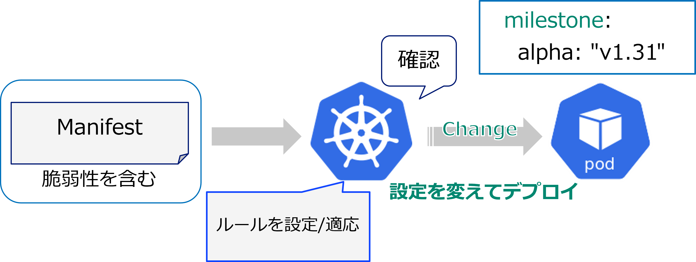

# Mutating Admission Policyとは

Kubernetes Build-inの仕組みで、任意のポリシー制御(Mutating)を行える、新しいAdmission Controlのアプローチ
ポリシーに違反するリソース等が配置される際に、ポリシーに準拠した設定に自動的に書き換えてくれるような機能。

## 構成するリソース

* Mutating Admission Policy：ポリシーのロジックを記述する。
* Mutating Admission Policy Binding：ネームスペースと記述したポリシーを紐づけする。
* (パラメータリソース:ポリシーの値だけ別管理したい場合等に使用)

