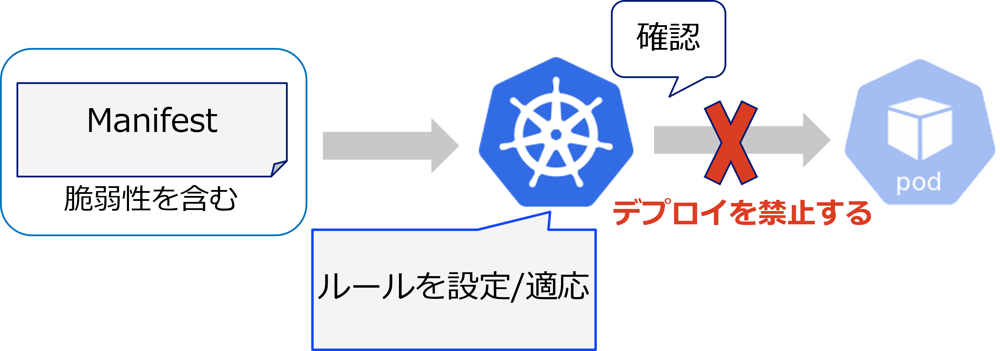

# Validating Admission Policyとは

Kubernetes Build-inの仕組みで、任意のポリシー制御(Validation)を行える、新しいAdmission Controlのアプローチ

k8sでポリシー制御を行う際はAdmission Webhookを利用したThird-partyツールを利用するのが一般的だった。
Admission Webhook は操作が複雑であったり、 自身でインストールしたり、運用・管理する必要があるなど、開発と運用に負担がかかる場合がある。

ValidatingAdmissionPolicyでは、CLE式をKubernetesリソースに埋め込むことにより、kube-apiserver単独でポリシー制御を行うことができるようになった。



## 構成するリソース

* Validating Admission Policy：ポリシーのロジックを記述する。
* Validating Admission Policy Binding：ネームスペースと記述したポリシーを紐づけする。
* ()

## ハンズアウト

case1：Privileged: trueの場合にデプロイを禁止する設定

* ValidatingAdmissionPolicyの記述
```
cat > ValidatingAdmissionPolicy-test.yaml << EOF
apiVersion: admissionregistration.k8s.io/v1beta1
kind: ValidatingAdmissionPolicy
metadata:
  name: "demo-policy.example.com"　　#ValidatingAdmissionPolicyの名前を設定
spec:
  failurePolicy: Fail
  matchConstraints:
    resourceRules:　　　 　　　　　　　　　　　　#適用するリソースの種類を設定
    - apiGroups:   [""]
      apiVersions: ["v1"]
      operations:  ["CREATE", "UPDATE"]
      resources:   ["pods"]
  validations:
    - expression: "object.spec.containers.all(container, !(has(container.securityContext)) || !(has(container.securityContext.privileged)) || container.securityContext.privileged != true)"　　#containerにsecurityContextが設定されており、かつprivilegedがTrueだった場合
      message: "Privileged container is not allowed."　　#ポリシーに違反した際に出力するメッセージを設定できる。
      reason: Forbidden
EOF
```

* ValidatingAdmissionPolicyBindingの例(ネームスペース"test"に上記のポリシーを設定)
```
cat > ValidatingAdmissionPolicyBinding-test.yaml << EOF
apiVersion: admissionregistration.k8s.io/v1beta1
kind: ValidatingAdmissionPolicyBinding
metadata:
  name: "demo-binding-test.example.com"  #Binding名を設定
spec:
  policyName: "demo-policy.example.com"  #適用したいポリシー名を設定
  validationActions: [Deny]
  matchResources:
    namespaceSelector:
      matchLabels:
        kubernetes.io/metadata.name: "test"　　#ネームスペース名が"test"に設定(ラベルが付与されていればラベルを設定)
EOF
```

* 補足：すべてのネームスペースに適用したい場合
```
apiVersion: admissionregistration.k8s.io/v1beta1
kind: ValidatingAdmissionPolicyBinding
metadata:
  name: "demo-binding-test.example.com"
spec:
  policyName: "demo-policy.example.com"
  validationActions: [Deny]
  matchResources:
    namespaceSelector: {}　#すべてのネームスペースに適用
```


